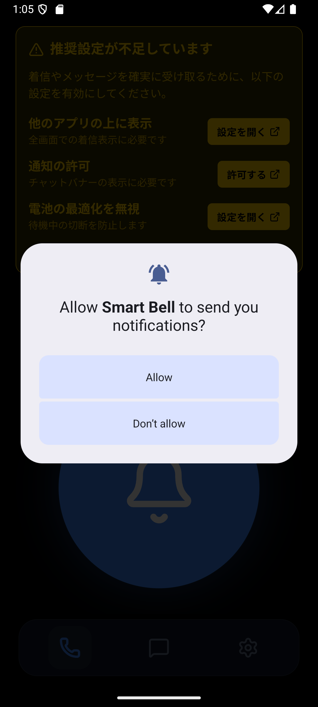
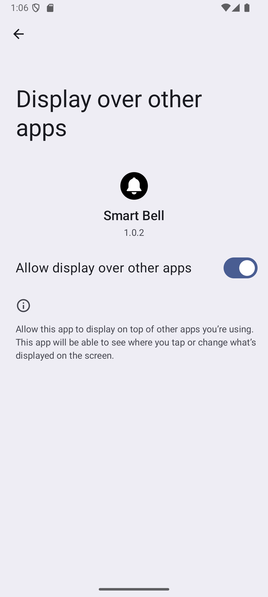
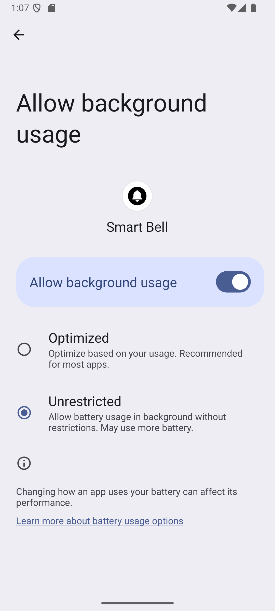
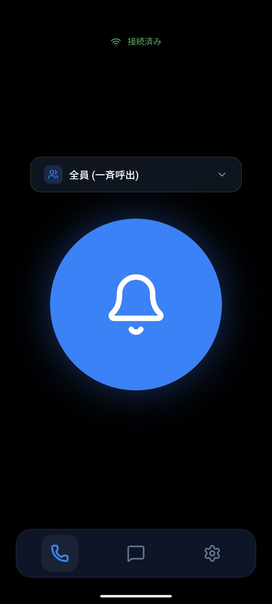
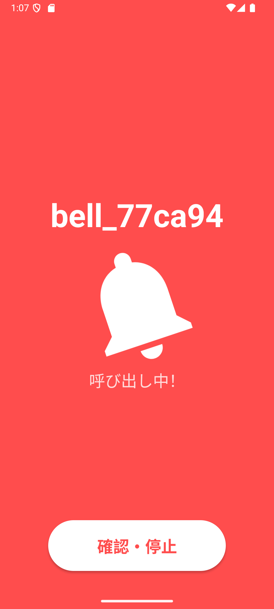
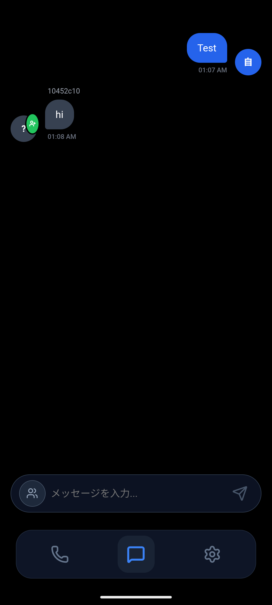
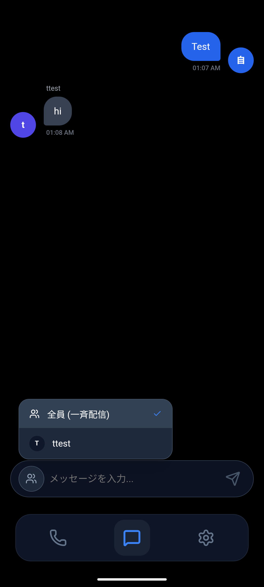
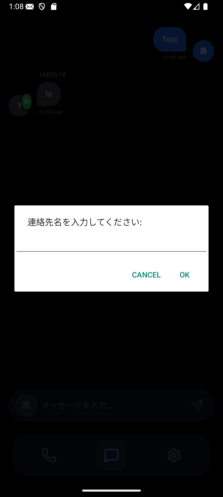

# 🔔 SmartBell

**家庭内や施設内での「呼び出し」と「チャット」を実現するスマートベルアプリ**

MQTTプロトコルを利用したリアルタイム通信で、離れた場所にいる家族や同僚に瞬時に通知を届けます。Androidネイティブ機能を活用し、アプリがバックグラウンドでも確実に着信・メッセージを受信できます。

---

## ✨ 主な機能

### 📞 ワンタップ呼び出し
大きなベルボタンをタップするだけで、登録した相手に即座に呼び出しを送信。全員への一斉通知も、特定の相手への個別通知も自由自在です。

### 💬 リアルタイムチャット
テキストメッセージを送受信できるチャット機能を搭載。LINEのようなヘッドアップ通知で、ホーム画面にいてもメッセージを見逃しません。

### 📱 フル画面着信表示
着信時は専用の全画面UIが表示され、誰からの呼び出しかが一目で分かります。バックグラウンドやロック画面でも動作します。

### 🔧 ホーム画面ウィジェット
特定の相手をワンタップで呼び出せるウィジェットを配置できます。毎回アプリを開く必要がなく、素早いアクションが可能です。

---

## 📸 スクリーンショット

### セットアップ

| 通知許可 | オーバーレイ許可 | バックグラウンド許可 |
|:---:|:---:|:---:|
|  |  |  |

アプリ初回起動時に、着信の確実な受信のために必要な権限を案内します。

---

### メイン画面

| 呼び出し画面 | 着信画面 |
|:---:|:---:|
|  |  |

- **呼び出し画面**: 中央の大きなベルボタンで発信。上部のドロップダウンから宛先を選択可能。
- **着信画面**: 赤い背景でアラート表示。発信者名と「確認・停止」ボタンを表示。

---

### チャット機能

| チャット画面 | 宛先選択 | 連絡先追加 |
|:---:|:---:|:---:|
|  |  |  |

- 吹き出し形式のモダンなメッセージUI
- 全員への一斉配信と個別送信を切り替え可能
- 連絡先はアプリ内で簡単に追加・管理

---

## 🛠 技術スタック

| カテゴリ | 技術 |
|----------|------|
| **フロントエンド** | React 19 + TypeScript |
| **モバイルフレームワーク** | Capacitor 8 |
| **通信プロトコル** | MQTT（WebSocket経由） |
| **ネイティブ機能** | Android Foreground Service, Overlay, Widgets |
| **UI** | Framer Motion, Lucide Icons |

---

## 🚀 セットアップ

### 前提条件
- Node.js 18以上
- Android Studio（Androidビルド用）
- MQTTブローカー（例: Mosquitto）

### インストール

```bash
# リポジトリをクローン
git clone https://github.com/sign1226/Smart_Bell.git
cd Smart_Bell

# 依存関係をインストール
npm install

# Webアセットをビルド
npm run build

# Androidプロジェクトに同期
npx cap sync android

# Android Studioで開く
npx cap open android
```

### 設定

1. アプリ内の設定画面でMQTTブローカーの接続情報を入力
2. 推奨権限（オーバーレイ、バックグラウンド、通知）を許可
3. 連絡先を追加して呼び出し・チャットを開始

---

## 🌐 MQTTブローカーのセットアップ

SmartBellはMQTTプロトコルを使用してリアルタイム通信を行います。**Mosquitto**（Eclipse Mosquitto）は軽量で高速なオープンソースのMQTTブローカーとして最も広く利用されており、本アプリでの使用を推奨します。

### Mosquittoのインストール

#### Windows

```bash
# wingetを使用
winget install EclipseFoundation.Mosquitto

# またはScoopを使用
scoop install mosquitto
```

#### Linux (Ubuntu/Debian)

```bash
sudo apt update
sudo apt install mosquitto mosquitto-clients
sudo systemctl enable mosquitto
sudo systemctl start mosquitto
```

#### macOS

```bash
brew install mosquitto
brew services start mosquitto
```

#### Docker

```bash
docker run -d --name mosquitto -p 1883:1883 -p 9001:9001 eclipse-mosquitto
```

### 設定例 (`mosquitto.conf`)

SmartBellはWebSocket経由でMQTTに接続します。以下の設定をMosquittoの設定ファイルに追加してください：

```conf
# 基本設定
listener 1883
protocol mqtt

# WebSocket用リスナー（SmartBellはこちらを使用）
listener 9001
protocol websockets

# 認証なし（開発・家庭内LAN用）
allow_anonymous true

# ログ設定
log_dest stdout
log_type all
```

> **💡 ヒント**: 設定ファイルの場所
> - **Windows**: `C:\Program Files\mosquitto\mosquitto.conf`
> - **Linux**: `/etc/mosquitto/mosquitto.conf`
> - **macOS (Homebrew)**: `/opt/homebrew/etc/mosquitto/mosquitto.conf`

### アプリでの接続設定

| 設定項目 | 値の例 |
|----------|--------|
| **ホスト** | `192.168.1.100`（ブローカーのIPアドレス） |
| **ポート** | `9001`（WebSocketポート） |

> **⚠️ 注意**: ポートには**WebSocket用のポート（9001）**を指定してください。標準MQTTポート（1883）ではなく、WebSocketリスナーのポートを使用します。

### 動作確認

Mosquittoが正しく動作しているか確認するには、以下のコマンドを使用します：

```bash
# 別のターミナルでサブスクライブ
mosquitto_sub -h localhost -t "smartbell/#" -v

# メッセージをパブリッシュ
mosquitto_pub -h localhost -t "smartbell/test" -m "Hello SmartBell!"
```

---

## 📄 ライセンス

MIT License

---

## 🤝 コントリビューション

Issue や Pull Request は大歓迎です！バグ報告や機能リクエストもお気軽にどうぞ。
